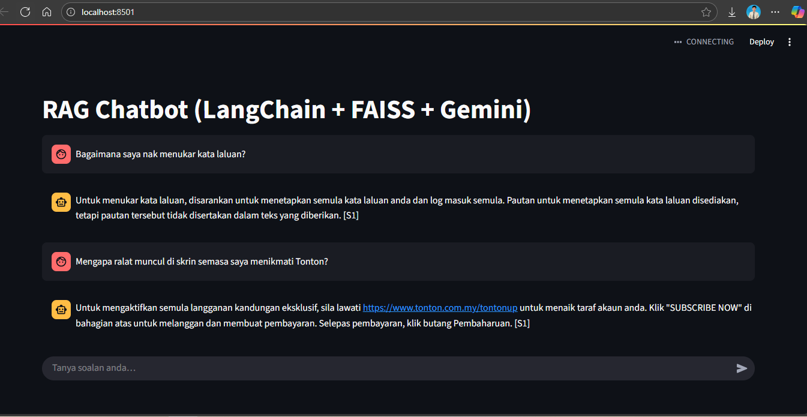

# RAG-chatbot
A Retrieval-Augmented Generation (RAG) chatbot that answers user questions based on custom document knowledge bases. Built using LangChain, FAISS, and Google Gemini embeddings, with a Streamlit frontend for interactive Q&A.


## Features:
- Ingests PDF, DOCX, TXT, and Markdown documents.
- Splits large documents into token-based chunks for efficient retrieval.
- Uses Google Gemini embeddings to vectorize content.
- Retrieves relevant context using FAISS and generates answers via LLMs.
- Filters disallowed questions for safety.
- Maintains chat history in Streamlit session state.

## Tech Stack:
Python | LangChain | FAISS | Google Gemini AI | Streamlit | .env

## Getting Started
### Prerequisites:
- Python 3.10
- Virtual environment (recommended)
### Install dependencies:
```bash
pip install -r requirements.txt
```
### Add environment variables:
Create a `.env` file in the project root:
```ini
GOOGLE_API_KEY=your_api_key_here
```
### Ingest documents:
Run the script to process and index your documents for retrieval:
```bash
python ingest.py data/faq.pdf
```
- `data/faq.pdf` → path to the document or folder you want to index. Full folder if not specified.
- Supports `.pdf`, `.txt`, `.md`, `.docx`.
### Run the app:
```bash
streamlit run app.py
```

## Notes:
- Supports multilingual embeddings via Google Gemini.
- Includes question filtering guardrails.
- Rebuild index by rerunning `ingest.py`.
